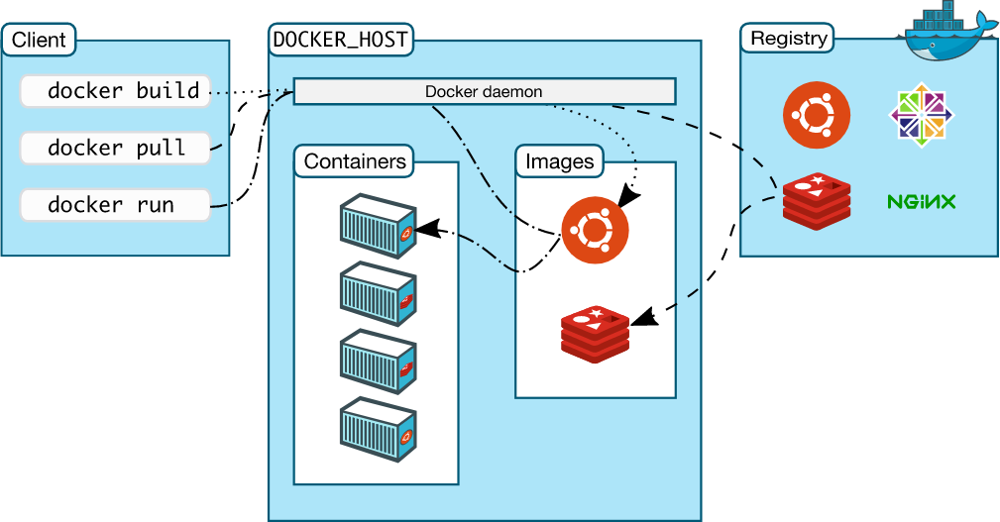

# Docker

> Docker 能干什么？

1. 简化配置，
2. 代码流水线管理
3. 提高开发效率
4. 隔离应用
5. 整合服务器
6. 调试能力
7. 多租户
8. 快速部署

> k8s 是干什么的？

它是一个容器编排的工具，对容器的创建、管理、调度、运维。

> 容器是什么？

在很久之前是先有一台服务器，再安装操作系统，再安装 App，缺点有很多

1. 部署非常慢
2. 成本非常高
3. 资源浪费
4. 难以迁移和扩展
5. 可能会被限定硬件厂商

虚拟化技术出现以后，通过一层 Hypervisor 来进行物理资源的虚拟化，在虚拟化之上安装操作系统，一个物理机可以部署多个 app，每个 app 独立运行在一个 VM 里，它有很多优点

1. 资源池——一个物理机的资源分配到不同的虚拟机里
2. 很容易扩展——加物理机器 or 加虚拟机
3. 很容易云化——亚马逊 AWS，阿里云等

它也有局限性，每一个虚拟机都是一个完整的操作系统，要给其分配资源，当虚拟机数量增多时，操作系统本身消耗的资源势必增多

现在开发和运维面临的挑战，在开发一个项目的时候，我们需要部署数据库，后台，缓存，可能会使用不同的后台语言和数据库，对于开发人员的测试很复杂。对于运维人员的部署也是非常复杂，还需要开发人员和运维人员的沟通，不然环境可能不一样

容器就是对 app 的打包，通过打包可以运行在任何环境中，容器是 APP 层面的隔离，虚拟化是物理资源层面的隔离，当然虚拟化和容器技术可以一起使用

1. 对软件和其依赖的标准化打包
2. 应用之间相互隔离
3. 共享同一个 OS Kernel
4. 可以运行在很多主流操作系统上

它解决了很多问题

1. 解决了开发和运维之间的矛盾
2. 在开发和运维之间搭建了一个桥梁，是实现 devops 的最佳解决方案


### 一些技巧

- `docker-machine`可以创建一个拥有 docker 的 linux 虚拟机
- `docker playground`可以不用安装 docker 来运行 docker
- 如果我们想不用`sudo`就使用`docker`命令，可以将用户加入`docker`用户组
  - `sudo groupadd docker`
  - `sudo gpasswd -a <user> docker`
  - 重启`docker`进程`sudo service docker restart`并重启`shell`

## Dock Platform
Docker 提供了一个开发，打包，运行app的平台，并把 app 和底层`infrastructure`隔离，按顺序分为以下几层
1. `Application`
2. `Docker Engine`它有以下几个东西
  - 后台进程`dockerd`：用于容器和存储的管理，`ps -ef | grep docker`可以看到进程在`/usr/bin/dockerd`
  - `REST API Server`：用于`dockerd`和`docker`通信
  - CLI接口`docker`：
3. `Infrastructure(physical/virtual)`

底层技术支持，都是 linux 早已存在的技术
- `Namespaces`：隔离`pid`，`net`，`ipc`，`mnt`，`uts`
- `Control group`：做资源限制
- `Union file systems`：`Container`和`image`的分层

### Docker Image
> image 是什么？
- 它是文件和`meta data`的集合`root filesystem`
- 分层的，并且每一层可以添加改变删除文件，成为一个新的`image`
- 不同的`image`可以共享相同的`layer`
- `Image`本身是`read-only`的
命令
- `docker history <image id>`：可查看 image 历史
- `docker images`或`docker image ls`：可以列出所有 docker
- `docker rmi`或`docker image rm <image id>`：移除`image`
- `docker build`或`docker image build`：根据一个`Dockerfile`创建`image`
获取`Image`
- `Build from Dockerfile`：根据`Dockerfile`进行构建
  ```yaml
  # base image
  FROM ubuntu:14.04
  # 基本标识
  LABEL maintainer="Peng Xiao <123@qq.com>
  # 在 base image 基础上跑命令
  RUN apt-get update && apt-get install -y redis-server
  # 暴露端口
  EXPOSE 6379
  # 通讯入口
  ENTRYPOINT ["/usr/bin/redis-server"]
  ```
  之后通过`docker build -t <image name> <dockerfile 路径>`来进行构建
- `Pull from Registry`：从`Registry`上获取`docker image`，具体`image`可从`https://hub.docker.com`上查阅

### Container
> Container 是什么？
- 通过`docker`创建
- 在`Image layer`之上建立一个`container layer`可读写
- 类比面向对象：类和实例
- `Image`负责 app 的存储和分发，`Container`负责运行`app`命令
- `docker run <image name>:<image version>`：基于`image`创建一个`container`，`version`不传表示最新
  - `-d`：让服务在后台执行
  - `--name`：可以指定名字
  - `--link <image name>`：可以连接上一个`image`，生成的`image`就可直接连接`link`的`image`
  - `--network <network name>`：可以指定创建某种类型的网络容器，有三种
    - `bridge`：也就是能够联网的容器
    - `none`：不能联网的容器
    - `host`：这个容器没有自己的`network namespace`，它是和主机共享一套`network namespace`，此时运行`ip a`和主机的`ip a`打印结果一致
  - `-p <容器端口>:<本地端口>`：端口映射，这样访问主机就能访问这个服务
  - `-e <env key=value>`：设置环境变量
- `docker ps -a`或`docker container ls`：列出当前本地正在运行的容器
  - `-a`：列出所有容器，包括正在运行和退出的
  - `-aq`：列出所有`container id`
  - `-it`：可以进入这个`image`里输入命令
  - 可通过`docker rm $(docker ps -aq)`将所有正在运行的`container`移除
  - `docker rm $(docker container ls -f "status-exited" -q)`将已经退出的容器移除
- `docker rm`或`docker container rm <container id>`：移除正在运行的`docker container`
- `docker commit <container id> <container name>`或`docker container commit`：基于某个`container`，在某个`container`中做了一些变化，比如安装了某些软件，就能将它再构建为一个`image`，但这种方式并不提倡
- `docker exec -it <container id> <command>`：可以进入正在运行的`container`中输入命令进行操作，比如`/bin/bash`命令可以使用命令进行操作
- `docker stop <container id | name>`：终止正在运行的容器
- `docker start <name>`：可将`container`启动
- `docker inspect <container id>`：可以显示这个`container`详细的信息
- `docker log <container id>`：容器的输出内容

### Dockerfile
github 上的`docker-library`有很多官方`image`的`dockerfile`，可以作为参考
- `FROM`：指定了我们定义的`base image`是什么，尽量使用官方的`image`
  - `FROM scratch`：制作`base image`
  - `FROM centos`：使用`base image`
- `LABEL`：指定`image`信息，类似于注释
  - `maintainer`：作者
  - `version`：版本
  - `description`：描述
- `RUN`：运行一些命令，但是要注意每运行一次`RUN`，`image`就会生成新的一层，复杂的`RUN`请用反斜线换行，避免无用分层，合并多条命令成一行。
- `CMD`：设置容器启动后默认执行的命令和参数
  - 如果`docker run`指定了其他命令，`CMD`命令会被忽略
  - 如果定义了多个`CMD`，只有最后一个会执行
  - 当`CMD`的值为`[]`时，可以在使用`docker run`时后面接需要输入的参数，比如
  ```dockerfile
  ENTRYPOINT ["/usr/bin/stress"]
  CMD []
  ```
- `ENTRYPOINT`：设置容器启动时运行的命令
  - 让容器以应用程序或服务的形式运行，比如说启动一个数据库
  - 不会被忽略，一定会执行
  - 最好写一个 shell 脚本作为`entrypoint`，比如
  ```dockerfile
  COPY docker-entrypoint.sh /usr/local/bin/
  ENTRYPOINT ["docker-entrypoint.sh"]
  ```
使用上面三个操作可以有两种格式
1. Shell 格式：`RUN apt-get install -y vim`，能够识别变量`ENV`
2. Exec 格式：`RUN ["apt-get", "install", "-y", "vim"]`，它不能识别变量，除非指定`shell`，比如`["/bin/bash", "-c", "echo hello $name"]`才会识别这里的`$name`变量
- `WORKDIR`：当前工作目录，如果后面的值没有则会自动创建目录，用`WORKDIR`，不要使用`RUN cd`，同时尽量使用绝对目录
- `ADD`：把本地文件添加到`image`里，它还可以将压缩文件解压缩
- `COPY`：类似`ADD`，但不能解压缩，大部分情况`COPY`优于`ADD`，添加远程文件/目录请使用`curl`或`wget`
- `ENV`：用于设定环境变量，在下面的命令里可以使用，可以增加可维护性
- `VOLUME`：可以设定本地持久化存储路径，比如`VOLUME ["/var/lib/mysql"]`，之后通过`docker run -v mysql:/var/lib/mysql`来进行    
每一步命令都会生成一个临时的`container id`，可以`dicker run -it <container id> /bin/bash`进行debug

### 镜像的发布
- 将`image`发布到`dockerhub`上
- 将`docker`和`github`关联
- 获取`registry`镜像，在本地服务器搭建一个本地`image`仓库

## Docker Network
当存在`docker network`时，本机使用`ip a`可以列出网络
- `veth`开头的网络用于连接两个`network namespace`
- `docker0`就是本地`docker`的网络，需要使用`veth`开头网络进行连接，其实就是主机的网络
当创建一个`container`时，也会创建一个`network namespace`
- `ip netns list`：列出所有的`namespace`
  - `ip netns delete <namespace name>`：删除某个`namespace`
- `docker network ls`：可列出网络情况，包括`networkid`、`name`、`driver`、`scope`
  - `bridge`：
- `docker network inspect <network id>`：可列出`network`详细情况，其中包括`Container`情况
  - 如果`network id`为`bridge`可列出`network namespace`的连接情况
每个容器都会连接`docker0`，之后`docker0`会通过`NAT`连接外网，从而让每个`container`都能连接外网
- `docker network create -d <network type> <network name>`：用于创建一个网络，其中`network type`可以为`bridge`，当`container`连接在同一个用户自定义的`bridge network`，这时连接上同一个`network`时，可以使用`ping <container name>`直接连接
- `docker network connect <network name> <container name>`：可让容器连接一个网络
`VXLAN`可以使用隧道进行多机通信

## Docker 的持久化存储和数据共享
在`Container`中进行数据的存储仅限于容器里面，在容器删除时数据也会被一起删除，现在的持久化数据的方案有两类
- 基于本地文件系统的`Volume`，可以在执行`Docker create`或`Docker run`时，通过`-v`参数将主机的目录作为容器的数据卷
- 基于`plugin`的`Volume`，支持第三方的存储方案，比如`NAS`，`aws`
`Volume`有两种类型
- 受管理的`data Volume`，由 docker 后台自动创建
- 绑定挂载的`Volume`，具体挂在位置可以由用户指定
`Mysql`在官方`Dockerfile`中有个配置项`Volume`可以将数据存储在它的值`/var/lib/mysql`中
- `docker volume ls`：查看本地的`volume`
- `docker volume inspect <volume id>`：查看对应`volume`的详细情况
- `docker volume rm <volume id>`：删除对应`volume`空间
删除`volume`后，可以通过`docker run`的`-v`选项创建拥有`volume`别名的`container`
- `docker run -d -v mysql:/var/lib/mysql ...`创建对应`volume`别名的`container`
可在`Dockfile`文件中自己设置`VOLUME`配置项来指定存储空间

### Bind Mouting
我们可以指定本地的文件存储路径和容器存储路径进行同步，比如`docker run -v /home/aaa:/root/aaa`

## Docker Compose
多容器的APP太恶心
- 要从`Dockerfile build image`或`Dockerhub`拉取`image`
- 要创建多个`container`
- 要管理这些`container`(启动停止删除）
此时可以通过`Docker Compose`进行批处理，它依赖于一个`yml`文件，这个文件有三大概念
- `Service`：相当于一个`container`，类似`docker run`，可以给其指定`network`和`volume`，所以可以给`service`指定`network`和`Volume`的引用
- `Network`：可以指定网络
- `Volume`：可以指定`volume`

### docker-compose 命令
linux 下安装：`https://docs.docker.com/compose/install/#install-compose`
- `docker-compose up`：启动`compose`
  - `-f <yml文件>`：不加上这个选项相当于`-f docker-compose.yml`，即当前目录下的`docker-compose.yml`文件
  - `-d`：后台启动，但此时不会打印 log
  - `--scale <SERVICE=NUM>`：将`service`增加到`num`个，也就是启动三个同样的服务，加上`haproxy`可以用于负载均衡
- `docker-compose ps`：查看启动的所有`service`
- `docker-compose stop`：会停止所有`service`
- `docker-compose down`：会停止所有`service`并删除定义的`service`，`network`，`volume`，但不会删除`image`
- `docker-compose images`：列举出`container`以及使用的`image`
- `docker-compose exec <Service> <command>`：和`docker exec`类似

## Swarm Mode
这个容器编排工具已经集成在 docker 里了，只不过正常不是运行在这个模式下
`Swarm`是一个集群的架构，集群就会有节点，节点就会有角色，有两种角色
- `Manager`：集群的大脑，如果有多个`Manager`就需要进行同步，这里就会用到一个分布式的数据库`Raft consensus group`
- `Worker`：也就是干活的节点，有的会通过网络同步信息
有两个重要的概念
- `Service`：和`docker compose`里的`Service`概念基本一致，相当于就是一个
- `Replicas`：做扩展，一个服务可能有多个相同的`container`来进行负载均衡，此时一个`container`就相当于一个·`replicas`

### docker swarm
- `docker swarm init`：初始化一个`swarm cluster`，这个命令会生成一个`token`，需要通过`docker swarm join --token <token>`来加入`cluster`
  - `--advertise-addr <ip>`：用于宣告一个地址让各个节点知道`cluster`的存在
- `docker swarm join --token <token>`：加入某个`cluster`
- `docker node ls`：显示当前 docker 的节点

### docker service    
`docker service`可以在整个集群中控制`service`
- `docker service create <image> <command>`：创建一个`service`，如果是`docker run`只能在本地创建`service`，而`service`命令可以在整个`cluster`创建`service`
  - `--name`：命名`service`
  - `-e`：设置环境变量
  - `--mount <type=类型名>`：类型名可以为`volume`，用预设值`volume`
  - `--network <netowrk>`：设置所在网络
- `docker service ls`：列出所有`service`
- `docker service ps <service>`：查看服务状态
- `docker service scale <service=num>`：用于扩展多个`servcie`，`num`为扩展的数量，扩展之后的服务会均衡分布在各个节点中，同时这个`scale`会保持`replicas`的数量不变，如果有`replicas`被`shutdown`，会在`service`内重新创建一个相同的`replicas`来进行修补
- `docker service rm <service>`：删除`service`
`service`是在不同的`swarm`几点中创建的，我们不知道它们的位置，所以我们需要在它们之间进行通信。我们可以通过`overlay`的方式让所有机器连在同一个网络中
- `docker network create -d overlay <network name>`：创建一个`overlay`网络，如果这个网络下有一个`service`，而这个`service`下的主机如果存在节点，就会共享网络
两个`Service`可以进行通信，连到同一个网络时可以通过服务名进行通信，利用的是`DNS`服务发现。
如果有`service`连接到一个`overlay`网络时，会有一条`DNS`记录，通过这个`DNS`记录就可以知道`service`的ip地址。
但是这里获得的ip不是每个服务的`docker`所在的ip，而是虚拟ip`vip`来解决，而同一个`service`下的`replicas`的ip是一样的，会和实际ip有一个`map`关系
上面说的技术就是`Routing Mesh`
- `internal`：`Container`和`Container`之间的访问通过`overlay`网络，也就是虚拟IP来做到负载均衡。其实虚拟`IP`就是`LVS(linux virtual Server)`用于高可用负载均衡
- `Ingress`：如果服务有绑定接口，则此服务可以通过任意`swarm`节点的相应接口访问，也就是在同一个`cluster`里可以通过端口访问服务
  - 外部访问的负载均衡
  - 服务端口碑暴露到各个`swarm`节点
  - 内部通过`IPVS`进行负载均衡，每次访问服务的时候让不同的`replicas`响应

